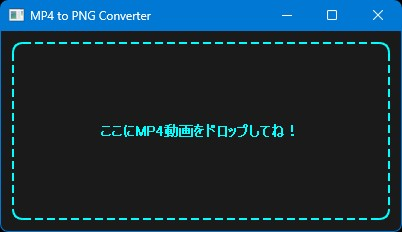

# MP4 to PNG Converter

## 機能概要

MP4動画の全フレームを連番PNG画像として一括抽出・保存できるシンプルなPyQt5製GUIツールです。

### 主な機能

- MP4動画をドラッグ＆ドロップで読み込み
- 動画の全フレームを1枚ずつPNG画像に変換
- 連番ファイル名（000000.png、000001.png …）で自動保存
- スクリプトと同じフォルダに`image-YYYYMMDDHHMMSS`というフォルダを自動作成してまとめて保存

### 一言で言うと

「MP4 to PNG Converter」（動画→連番PNG一括抽出ツール）

## 使い方

1. アプリを起動する

    ターミナルで`python mp4-image-converter.py`を実行（事前に`pip install PyQt5 opencv-python`を済ませておけよ）。

2. MP4動画をドロップする

    ウィンドウに変換したいMP4ファイルをドラッグ＆ドロップ。

3. 自動変換が始まる

    「変換中...」と表示され、全フレームがPNGとして抽出される。

4. 完了を確認する

    保存先フォルダ（`image-YYYYMMDDHHMMSS`）とフレーム数が表示される。    スクリプトと同じ場所にフォルダが作られているよ。

## 必要環境

- Python 3.10以上
- 必要なライブラリはソースコードの先頭に書いてあります。

## ライセンス

**MIT License** で公開しています。  
ご自由に使って、改変して、参考にしてください。  
ただし**自作発言はNG**でお願いします。